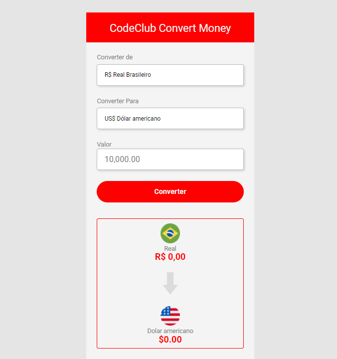

# Currency-Converter
 Conversor de moedas, os valores podem ser convertidos para Dólar, Euro e Bitcoin.

<b>> Resultado do conversor finalizado.</b>

O projeto foi criado em:

- [x] HTML
- [x] CSS
- [x] JavaScript

<b>Resultado Hospedado:</b> https://gleysiferreira.github.io/Currency-Converter/

## 🤝 Colaboradores

Pessoa que contribuiu para este projeto:

<table>
  <tr>
    <td align="center">
         
        
          <b>Gleysi Ferreira</b>
        
      </a>
    </td>
   </tr>
</table>
